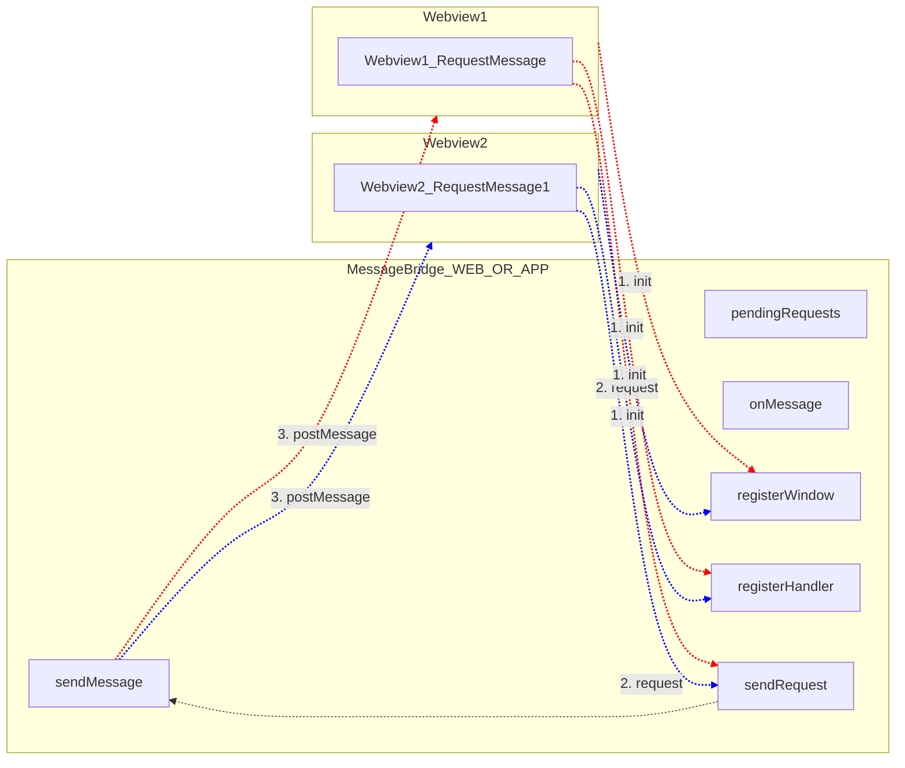

# (destoryed)message_bridge_register_window 다이어그램

```mermaid
%% WEB <-> APP 메시지 통신을 위한 window 등록
graph LR
%% __START
    subgraph MessageBridge_WEB_OR_APP
        pendingRequests
        onMessage
        registerWindow
        registerHandler
        sendMessage
        sendRequest
    end

    Webview1 -.-> |1. init| registerWindow
    Webview1_RequestMessage -.-> |1. init| registerHandler
    Webview1_RequestMessage -.-> |2. request| sendRequest
    sendMessage -.-> |3. postMessage| Webview1
    Webview2 -.-> |1. init| registerWindow
    Webview2_RequestMessage1 -.-> |1. init| registerHandler
    Webview2_RequestMessage1 -.-> |2. request| sendRequest
    sendMessage -.-> |3. postMessage| Webview2
    sendRequest -.-> sendMessage

    linkStyle 0,1,2,3 stroke:red, stroke-width:2px;
    linkStyle 4,5,6,7 stroke:blue, stroke-width:2px;

    subgraph Webview1
        Webview1_RequestMessage
    end

    subgraph Webview2
        Webview2_RequestMessage1
    end
%% __END


```
