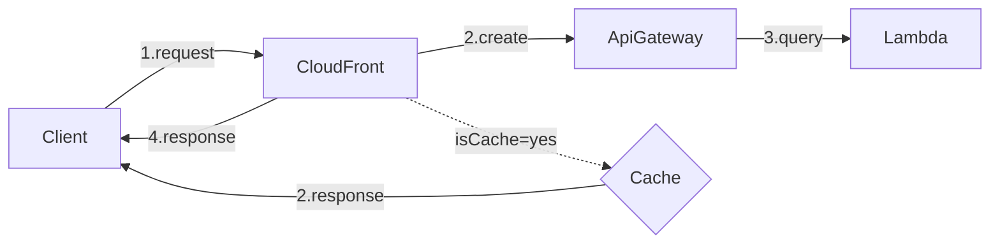

# api-gateway 다이어그램

```mermaid
%% API gateway + CloudFront
graph LR
%% __START
    Client --> |1.request| CloudFront
    CloudFront --> |2.create| ApiGateway
    ApiGateway --> |3.query| Lambda
    CloudFront --> |4.response| Client

    CloudFront -.-> |isCache=yes| CloudFront_{Cache} --> |2.response| Client

%% __END
```
