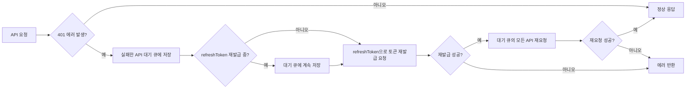

# api_refreshToken 다이어그램

```mermaid
%% Api token expired - refresh token
graph LR
    A[API 요청] --> B{401 에러 발생?}
    B -- 아니오 --> Z[정상 응답]
    B -- 예 --> C[실패한 API 대기 큐에 저장]
    C --> D{refreshToken 재발급 중?}
    D -- 아니오 --> E[refreshToken으로 토큰 재발급 요청]
    E --> F{재발급 성공?}
    F -- 예 --> G[대기 큐의 모든 API 재요청]
    G --> H{재요청 성공?}
    H -- 예 --> Z
    H -- 아니오 --> I[에러 반환]
    F -- 아니오 --> I
    D -- 예 --> J[대기 큐에 계속 저장]
    J --> E

```
