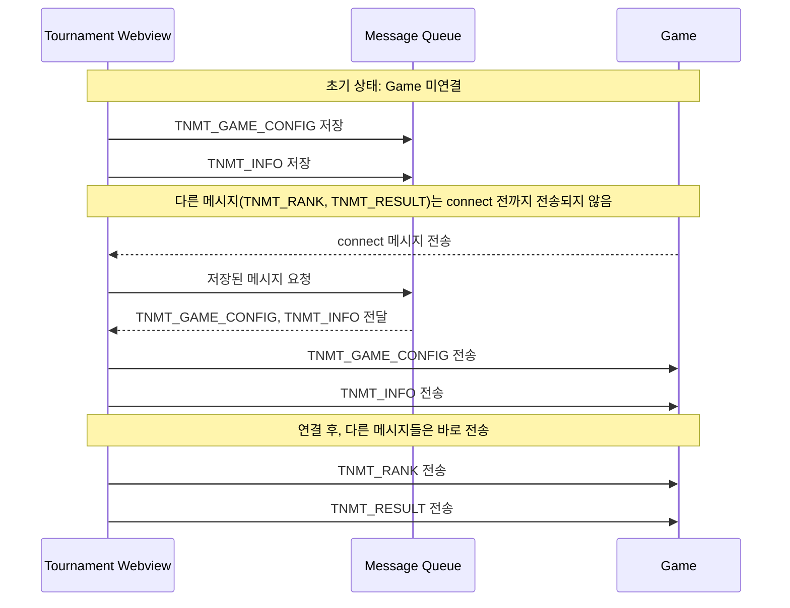

# architecture_gameMessage 다이어그램

```mermaid
sequenceDiagram
    participant WV as Tournament Webview
    participant MQ as Message Queue
    participant Game

    Note over WV, Game: 초기 상태: Game 미연결

    WV->>MQ: TNMT_GAME_CONFIG 저장
    WV->>MQ: TNMT_INFO 저장

    Note over WV, Game: 다른 메시지(TNMT_RANK, TNMT_RESULT)는 connect 전까지 전송되지 않음

    Game-->>WV: connect 메시지 전송

    WV->>MQ: 저장된 메시지 요청
    MQ-->>WV: TNMT_GAME_CONFIG, TNMT_INFO 전달

    WV->>Game: TNMT_GAME_CONFIG 전송
    WV->>Game: TNMT_INFO 전송

    Note over WV, Game: 연결 후, 다른 메시지들은 바로 전송

    WV->>Game: TNMT_RANK 전송
    WV->>Game: TNMT_RESULT 전송
```
