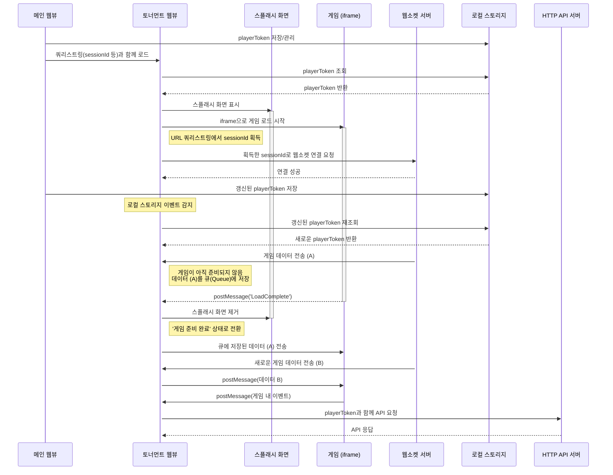

# architecture_gameWebview 다이어그램

```mermaid
sequenceDiagram
    participant MainWebView as 메인 웹뷰
    participant TournamentWebView as 토너먼트 웹뷰
    participant SplashScreen as 스플래시 화면
    participant Game as 게임 (iframe)
    participant WebSocketServer as 웹소켓 서버
    participant LocalStorage as 로컬 스토리지
    participant HTTPApiServer as HTTP API 서버

    MainWebView->>LocalStorage: playerToken 저장/관리

    MainWebView->>TournamentWebView: 쿼리스트링(sessionId 등)과 함께 로드
    activate TournamentWebView

    TournamentWebView->>LocalStorage: playerToken 조회
    LocalStorage-->>TournamentWebView: playerToken 반환

    TournamentWebView->>SplashScreen: 스플래시 화면 표시
    activate SplashScreen

    TournamentWebView->>Game: iframe으로 게임 로드 시작
    activate Game

    Note right of TournamentWebView: URL 쿼리스트링에서 sessionId 획득
    TournamentWebView->>WebSocketServer: 획득한 sessionId로 웹소켓 연결 요청
    activate WebSocketServer
    WebSocketServer-->>TournamentWebView: 연결 성공

%% 토큰 갱신 시나리오 %%
    MainWebView->>LocalStorage: 갱신된 playerToken 저장
    Note over TournamentWebView: 로컬 스토리지 이벤트 감지
    TournamentWebView->>LocalStorage: 갱신된 playerToken 재조회
    LocalStorage-->>TournamentWebView: 새로운 playerToken 반환

%% 게임 로드 전, 서버에서 메시지가 먼저 도착하는 경우 %%
    WebSocketServer->>TournamentWebView: 게임 데이터 전송 (A)
    Note right of TournamentWebView: 게임이 아직 준비되지 않음<br/>데이터 (A)를 큐(Queue)에 저장

%% 게임 로드가 완료되는 시점 %%
    Game-->>TournamentWebView: postMessage('LoadComplete')
    deactivate Game

    TournamentWebView->>SplashScreen: 스플래시 화면 제거
    deactivate SplashScreen

    Note right of TournamentWebView: '게임 준비 완료' 상태로 전환
    TournamentWebView->>Game: 큐에 저장된 데이터 (A) 전송

%% 게임 준비 완료 후 실시간 통신 %%
    WebSocketServer->>TournamentWebView: 새로운 게임 데이터 전송 (B)
    TournamentWebView->>Game: postMessage(데이터 B)

    Game->>TournamentWebView: postMessage(게임 내 이벤트)

%% HTTP API 요청 시나리오 %%
    TournamentWebView->>HTTPApiServer: playerToken과 함께 API 요청
    HTTPApiServer-->>TournamentWebView: API 응답
```
