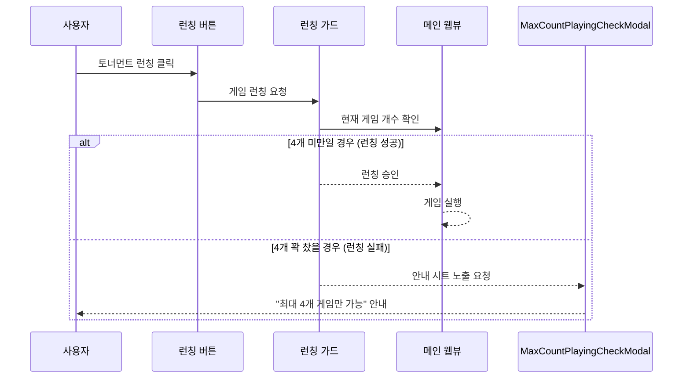

# architecture_maxGame 다이어그램

```mermaid
sequenceDiagram
    participant User as 사용자
    participant LaunchButton as 런칭 버튼
    participant LaunchGuard as 런칭 가드
    participant MainWebView as 메인 웹뷰
    participant InfoSheet as MaxCountPlayingCheckModal

    User->>LaunchButton: 토너먼트 런칭 클릭

    LaunchButton->>LaunchGuard: 게임 런칭 요청

    LaunchGuard->>MainWebView: 현재 게임 개수 확인
    alt 4개 미만일 경우 (런칭 성공)
        LaunchGuard-->>MainWebView: 런칭 승인
        MainWebView-->>MainWebView: 게임 실행
    else 4개 꽉 찼을 경우 (런칭 실패)
        LaunchGuard-->>InfoSheet: 안내 시트 노출 요청
        InfoSheet-->>User: "최대 4개 게임만 가능" 안내
    end
```
