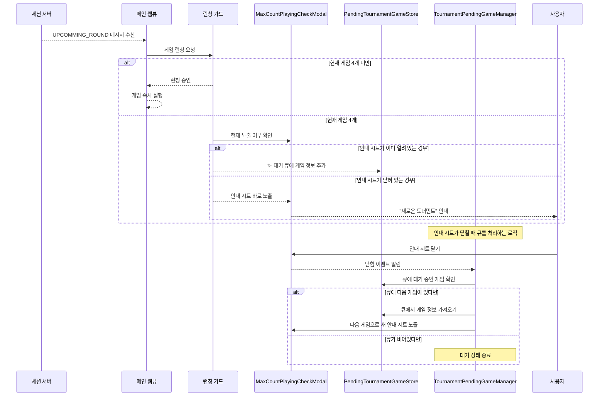

# architecture_maxGameQueue 다이어그램

```mermaid
sequenceDiagram
    participant WebSocket as 세션 서버
    participant MainWebView as 메인 웹뷰
    participant LaunchGuard as 런칭 가드
    participant InfoSheet as MaxCountPlayingCheckModal
    participant PendingGameStore as PendingTournamentGameStore
    participant PendingGameManager as TournamentPendingGameManager
    participant User as 사용자

    WebSocket-->>MainWebView: UPCOMMING_ROUND 메시지 수신

    MainWebView->>LaunchGuard: 게임 런칭 요청
    alt 현재 게임 4개 미만
        LaunchGuard-->>MainWebView: 런칭 승인
        MainWebView-->>MainWebView: 게임 즉시 실행
    else 현재 게임 4개
        LaunchGuard->>InfoSheet: 현재 노출 여부 확인
        alt 안내 시트가 이미 열려 있는 경우
            LaunchGuard-->>PendingGameStore: ✨ 대기 큐에 게임 정보 추가
        else 안내 시트가 닫혀 있는 경우
            LaunchGuard-->>InfoSheet: 안내 시트 바로 노출
            InfoSheet-->>User: "새로운 토너먼트" 안내
        end
    end

    Note over PendingGameManager: 안내 시트가 닫힐 때 큐를 처리하는 로직
    User->>InfoSheet: 안내 시트 닫기
    InfoSheet-->>PendingGameManager: 닫힘 이벤트 알림

    PendingGameManager->>PendingGameStore: 큐에 대기 중인 게임 확인
    alt 큐에 다음 게임이 있다면
        PendingGameManager->>PendingGameStore: 큐에서 게임 정보 가져오기
        PendingGameManager->>InfoSheet: 다음 게임으로 새 안내 시트 노출
    else 큐가 비어있다면
        Note over PendingGameManager: 대기 상태 종료
    end
```
