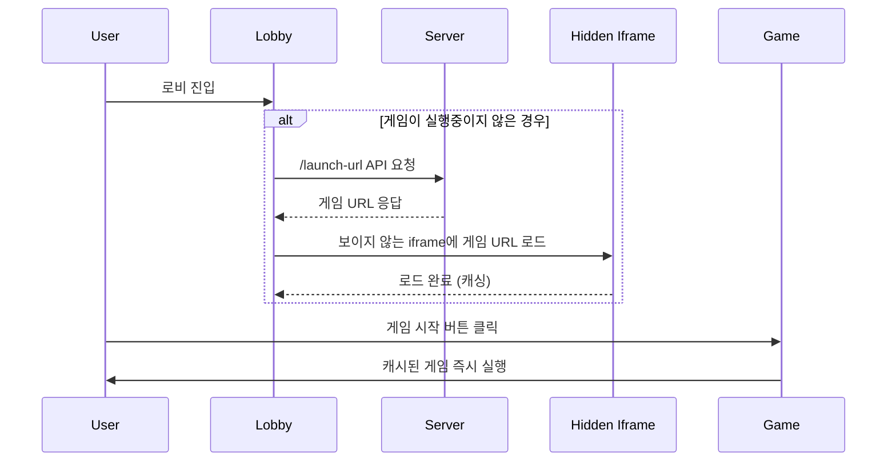

# architecture_preloadGame 다이어그램

```mermaid
sequenceDiagram
    participant User
    participant Lobby
    participant Server
    participant HiddenIframe as Hidden Iframe
    participant Game

    User->>Lobby: 로비 진입
    alt 게임이 실행중이지 않은 경우
        Lobby->>Server: /launch-url API 요청
        Server-->>Lobby: 게임 URL 응답
        Lobby->>HiddenIframe: 보이지 않는 iframe에 게임 URL 로드
        HiddenIframe-->>Lobby: 로드 완료 (캐싱)
    end

    User->>Game: 게임 시작 버튼 클릭
    Game->>User: 캐시된 게임 즉시 실행
```
