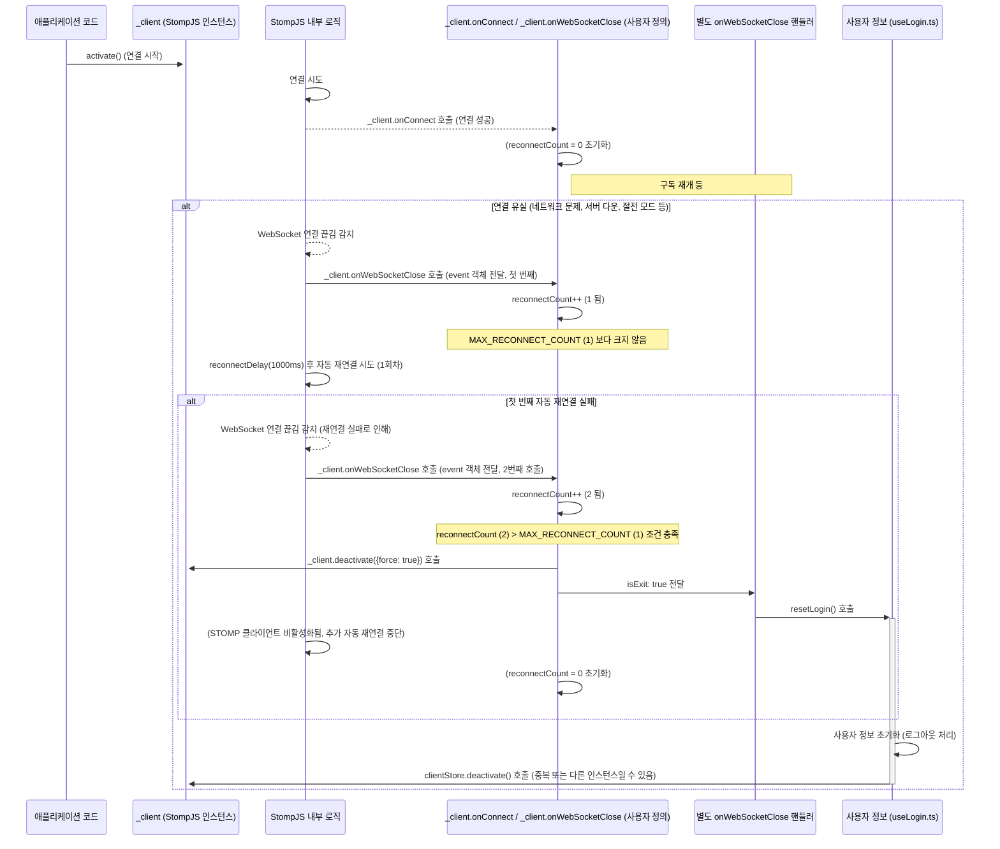

# architecture_session_token_asis 다이어그램

```mermaid
sequenceDiagram
    participant App as 애플리케이션 코드
    participant StompClient as _client (StompJS 인스턴스)
    participant StompLogic as StompJS 내부 로직
    participant CustomCallbacks as _client.onConnect / _client.onWebSocketClose (사용자 정의)
    participant WSCloseHandler as 별도 onWebSocketClose 핸들러
    participant UserSession as 사용자 정보 (useLogin.ts)

    App ->>+ StompClient: activate() (연결 시작)
    StompLogic ->> StompLogic: 연결 시도
    StompLogic -->> CustomCallbacks: _client.onConnect 호출 (연결 성공)
    CustomCallbacks ->> CustomCallbacks: (reconnectCount = 0 초기화)
    Note right of CustomCallbacks: 구독 재개 등

    alt 연결 유실 (네트워크 문제, 서버 다운, 절전 모드 등)
        StompLogic -->> StompLogic: WebSocket 연결 끊김 감지
        StompLogic ->> CustomCallbacks: _client.onWebSocketClose 호출 (event 객체 전달, 첫 번째)
        CustomCallbacks ->> CustomCallbacks: reconnectCount++ (1 됨)
        Note over CustomCallbacks: MAX_RECONNECT_COUNT (1) 보다 크지 않음

        StompLogic ->> StompLogic: reconnectDelay(1000ms) 후 자동 재연결 시도 (1회차)

        alt 첫 번째 자동 재연결 실패
            StompLogic -->> StompLogic: WebSocket 연결 끊김 감지 (재연결 실패로 인해)
            StompLogic ->> CustomCallbacks: _client.onWebSocketClose 호출 (event 객체 전달, 2번째 호출)
            CustomCallbacks ->> CustomCallbacks: reconnectCount++ (2 됨)
            Note over CustomCallbacks: reconnectCount (2) > MAX_RECONNECT_COUNT (1) 조건 충족
            CustomCallbacks ->> StompClient: _client.deactivate({force: true}) 호출
            CustomCallbacks ->> WSCloseHandler: isExit: true 전달
            WSCloseHandler ->>+ UserSession: resetLogin() 호출
            StompLogic ->> StompLogic: (STOMP 클라이언트 비활성화됨, 추가 자동 재연결 중단)
            CustomCallbacks ->> CustomCallbacks: (reconnectCount = 0 초기화)
        end

        UserSession ->> UserSession: 사용자 정보 초기화 (로그아웃 처리)
        UserSession ->>- StompClient: clientStore.deactivate() 호출 (중복 또는 다른 인스턴스일 수 있음)
    end

```
