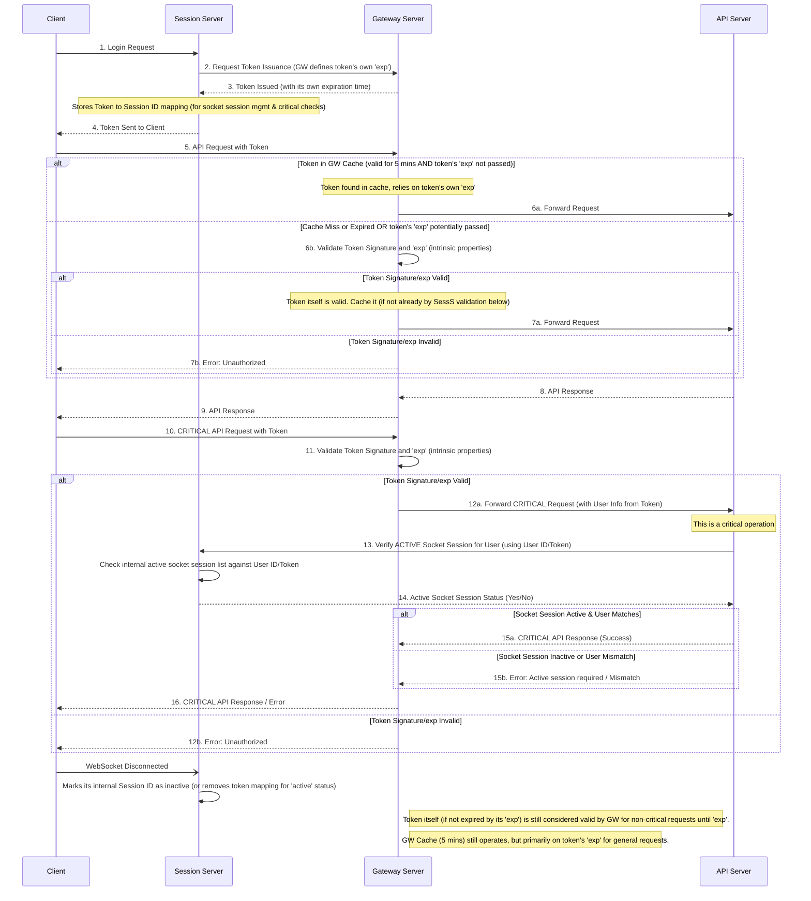

# architecture_session_token_tobe 다이어그램

```mermaid
sequenceDiagram
    participant C as Client
    participant SessS as Session Server
    participant GW as Gateway Server
    participant APIS as API Server

    %% Token Issuance (Existing Flow - GW issues token via SessS request)
    C->>SessS: 1. Login Request
    SessS->>GW: 2. Request Token Issuance (GW defines token's own 'exp')
    GW-->>SessS: 3. Token Issued (with its own expiration time)
    Note over SessS: Stores Token to Session ID mapping (for socket session mgmt & critical checks)
    SessS-->>C: 4. Token Sent to Client

    %% General API Request (GW Cache + Token's own validity, SessS mapping NOT primary for expiration)
    C->>GW: 5. API Request with Token
    alt Token in GW Cache (valid for 5 mins AND token's 'exp' not passed)
    Note over GW: Token found in cache, relies on token's own 'exp'
    GW->>APIS: 6a. Forward Request
    else Cache Miss or Expired OR token's 'exp' potentially passed
    GW->>GW: 6b. Validate Token Signature and 'exp' (intrinsic properties)
    alt Token Signature/exp Valid
    Note over GW: Token itself is valid. Cache it (if not already by SessS validation below)
    GW->>APIS: 7a. Forward Request
    %% Optional: GW could still ask SessS if this token is known, but not for 'is socket active?' for general APIs
    %% GW->>SessS: (Optional) Is this a known/valid token mapping? (Not for active session check)
    %% SessS-->>GW: (Optional) Yes/No
    else Token Signature/exp Invalid
    GW-->>C: 7b. Error: Unauthorized
    end
    end
    APIS-->>GW: 8. API Response
    GW-->>C: 9. API Response

    %% Critical API Request (Token's own validity + SessS Active Socket Session Check)
    C->>GW: 10. CRITICAL API Request with Token
    GW->>GW: 11. Validate Token Signature and 'exp' (intrinsic properties)
    alt Token Signature/exp Valid
    GW->>APIS: 12a. Forward CRITICAL Request (with User Info from Token)
    Note over APIS: This is a critical operation
    APIS->>SessS: 13. Verify ACTIVE Socket Session for User (using User ID/Token)
    SessS->>SessS: Check internal active socket session list against User ID/Token
    SessS-->>APIS: 14. Active Socket Session Status (Yes/No)
    alt Socket Session Active & User Matches
    APIS-->>GW: 15a. CRITICAL API Response (Success)
    else Socket Session Inactive or User Mismatch
    APIS-->>GW: 15b. Error: Active session required / Mismatch
    end
    GW-->>C: 16. CRITICAL API Response / Error
    else Token Signature/exp Invalid
    GW-->>C: 12b. Error: Unauthorized
    end

    %% Socket Disconnection (Session Server updates its state, but Token's 'exp' remains)
    C-)SessS: WebSocket Disconnected
    SessS->>SessS: Marks its internal Session ID as inactive (or removes token mapping for 'active' status)
    Note right of GW: Token itself (if not expired by its 'exp') is still considered valid by GW for non-critical requests until 'exp'.
    Note right of GW: GW Cache (5 mins) still operates, but primarily on token's 'exp' for general requests.
```
