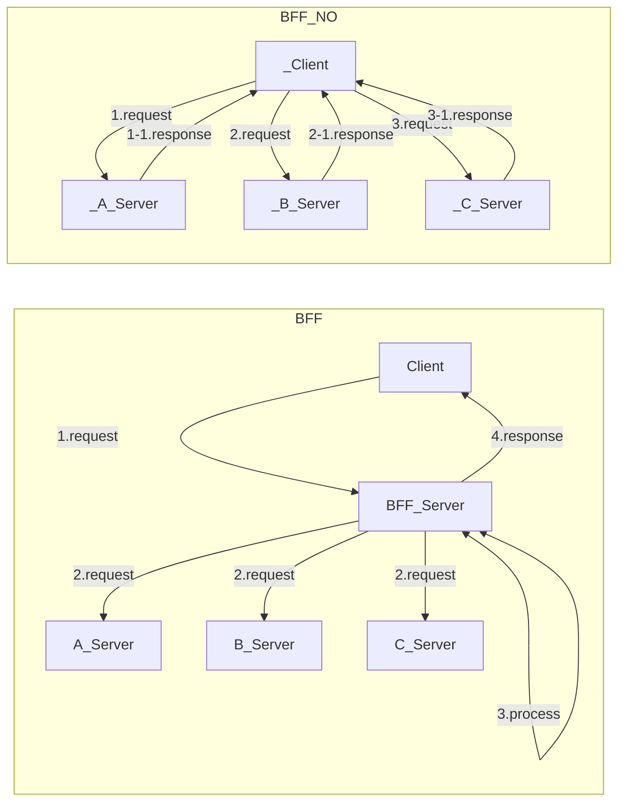

# bff 다이어그램

```mermaid
%% BFF
graph LR
    %% __START
    Client --> |1.request| BFF_Server
    BFF_Server --> |2.request| A_Server
    BFF_Server --> |2.request| B_Server
    BFF_Server --> |2.request| C_Server
    BFF_Server <--> |3.process| BFF_Server
    BFF_Server --> |4.response| Client

    subgraph BFF
        Client
        BFF_Server
        A_Server
        B_Server
        C_Server
    end

    _Client --> |1.request| _A_Server
    _Client --> |2.request| _B_Server
    _Client --> |3.request| _C_Server
    _A_Server --> |1-1.response| _Client
    _B_Server --> |2-1.response| _Client
    _C_Server --> |3-1.response| _Client

    subgraph BFF_NO
        _Client
        _A_Server
        _B_Server
        _C_Server
    end
    %% __END


```
