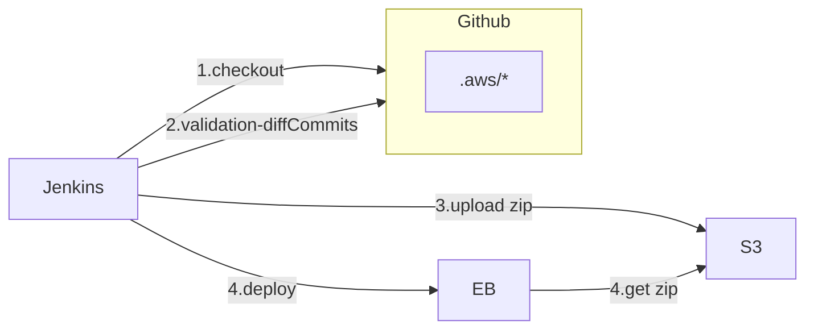

# cicd-eb 다이어그램

```mermaid
%% CI/CD EB
graph LR
%% __START
    Jenkins --> |1.checkout| Github
    Jenkins --> |2.validation-diffCommits| Github
    Jenkins --> |3.upload zip| S3
    Jenkins --> |4.deploy| EB
    EB --> |4.get zip| S3

    subgraph "Github"
        .aws/*
    end
%% __END
```
