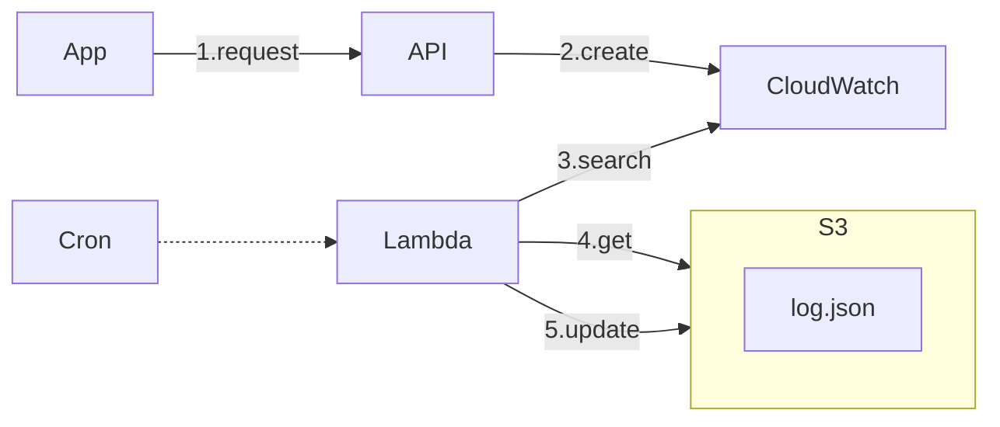

# cloudwatch-countLog 다이어그램

```mermaid
%% Use cloudwatch, create s3 log
graph LR
%% __START
    App --> |1.request| API
    API --> |2.create| CloudWatch
    Cron -.-> Lambda
    Lambda --> |3.search| CloudWatch
    Lambda --> |4.get| S3
    Lambda --> |5.update| S3

    subgraph S3
        log.json
    end
%% __END
```
