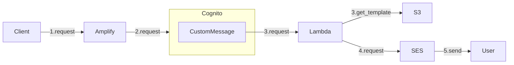

# cognito_customMessage 다이어그램

```mermaid
%% Cognito CustomMessage
graph LR
    subgraph Cognito
        CustomMessage
    end

    Client --> |1.request| Amplify
    Amplify --> |2.request| Cognito
    CustomMessage --> |3.request| Lambda
    Lambda --> |3.get_template| S3
    Lambda --> |4.request| SES
    SES --> |5.send| User
%% __END


```
