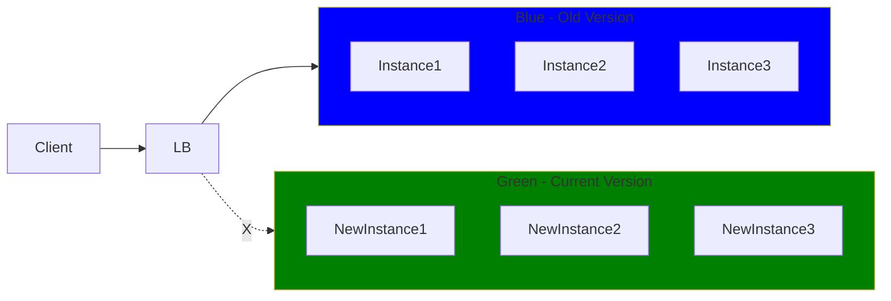

# ec2_rollback 다이어그램

```mermaid
%% EC2 롤백
graph LR
%% __START
    Client --> LB
    LB --> Blue
    LB -.-> |X| Green

    subgraph "Blue"[Blue - Old Version]
        Instance1
        Instance2
        Instance3
    end

    subgraph "Green"[Green - Current Version]
        NewInstance1
        NewInstance2
        NewInstance3
    end

    style Green fill:green
    style Blue fill:blue
%% __END


```
