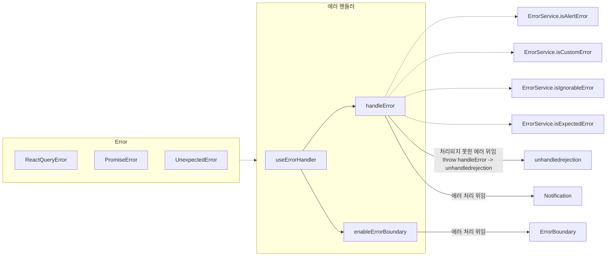

# error_useErrorhandler 다이어그램

```mermaid
%% errorHandling - useErrorHandler
graph LR
    %% __START useErrorHandler
    useErrorHandler --> handleError
    useErrorHandler --> enableErrorBoundary
    handleError -.-> ErrorService.isAlertError
    handleError -.-> ErrorService.isCustomError
    handleError -.-> ErrorService.isIgnorableError
    handleError -.-> ErrorService.isExpectedError
    handleError --> |처리되지 못한 에러 위임 throw handleError -> unhandledrejection| unhandledrejection
    handleError --> |에러 처리 위임| Notification
    enableErrorBoundary --> |에러 처리 위임| ErrorBoundary

    subgraph UseErrorHandlerGroup["에러 핸들러"]
        useErrorHandler
        handleError
        enableErrorBoundary
    end

    %% __END useErrorHandler

    subgraph Error
        ReactQueryError
        PromiseError
        UnexpectedError
    end

    Error -.-> UseErrorHandlerGroup

```
