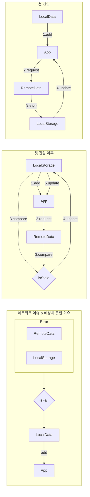

# localization 다이어그램

```mermaid
%% 번역 데이터 관리
graph LR
%% __START
    subgraph "네트워크 이슈 & 예상치 못한 이슈"
        Error --> isFail{isFail}
        LocalData3[LocalData] --> |add| App3[App]
        isFail{isFail} --> LocalData3[LocalData]

        subgraph "Error"
            RemoteData3[RemoteData]
            LocalStorage3[LocalStorage]
        end
    end

    subgraph "첫 진입 이후"
        LS2[LocalStorage] --> |1.add| App2[App]
        App2[App] --> |2.request| RemoteData2[RemoteData]
        LS2[LocalStorage] -.-> |3.compare| isStale{isStale}
        RemoteData2[RemoteData] -.-> |3.compare| isStale{isStale}
        isStale{isStale} --> |4.update| LS2[LocalStorage]
        LS2[LocalStorage] --> |5.update| App2[App]
    end

    subgraph "첫 진입"
        LocalData --> |1.add| App
        App --> |2.request| RemoteData
        RemoteData --> |3.save| LocalStorage
        LocalStorage --> |4.update| App
    end
%% __END
```
