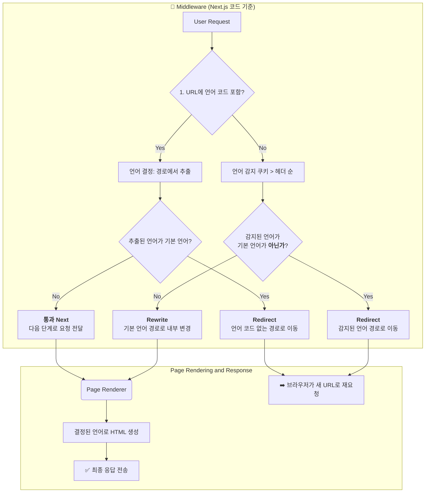

# localization_middleware 다이어그램

```mermaid
graph TD
subgraph "🚀 Middleware (Next.js 코드 기준)"
A[User Request] --> B{1. URL에 언어 코드 포함?};

B -- Yes --> C[언어 결정: 경로에서 추출];
C --> D{추출된 언어가 기본 언어?};
D -- Yes --> E[<b>Redirect</b><br/>언어 코드 없는 경로로 이동];
D -- No --> F[<b>통과 Next</b><br/>다음 단계로 요청 전달];

B -- No --> G[언어 감지 쿠키 > 헤더 순];
G --> H{감지된 언어가<br/>기본 언어가 <b>아닌가</b>?};
H -- Yes --> I[<b>Redirect</b><br/>감지된 언어 경로로 이동];
H -- No --> J[<b>Rewrite</b><br/>기본 언어 경로로 내부 변경];
end

subgraph "Page Rendering and Response"
F --> K(Page Renderer);
J --> K;
K --> L[결정된 언어로 HTML 생성];
L --> M[✅ 최종 응답 전송];
E --> N[➡️ 브라우저가 새 URL로 재요청];
I --> N;
end
```
