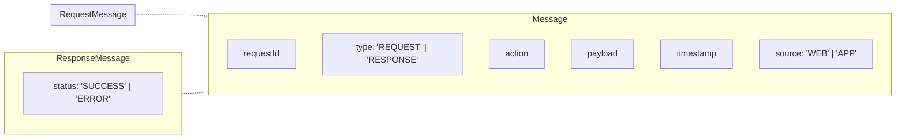

# message_Message 다이어그램

```mermaid
%% WEB-APP - 메시지 구조
graph LR
    %% __START
    subgraph Message
        requestId
        type["type: 'REQUEST' | 'RESPONSE'"]
        action
        payload
        timestamp
        source["source: 'WEB' | 'APP'"]
    end
    %% __END

    subgraph RequestMessage

    end

    subgraph ResponseMessage
        status["status: 'SUCCESS' | 'ERROR'"]
    end

    RequestMessage -.- Message
    ResponseMessage -.- Message
```
