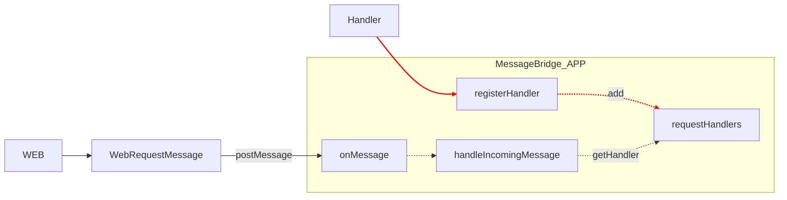

# message_MessageHandler 다이어그램

```mermaid
%% WEB-APP - MessageHandler 등록
graph LR
    %% __START

    Handler --> registerHandler
    registerHandler -.-> |add| requestHandlers

    linkStyle 0,1 stroke:red, stroke-width:2px;

    subgraph MessageBridge_APP
        onMessage
        requestHandlers
        registerHandler
        handleIncomingMessage
    end

    WEB --> WebRequestMessage
    WebRequestMessage --> |postMessage| onMessage

    subgraph MessageBridge_APP
        onMessage
        registerHandler
    end

    onMessage -.-> handleIncomingMessage
    handleIncomingMessage -.-> |getHandler| requestHandlers
```
