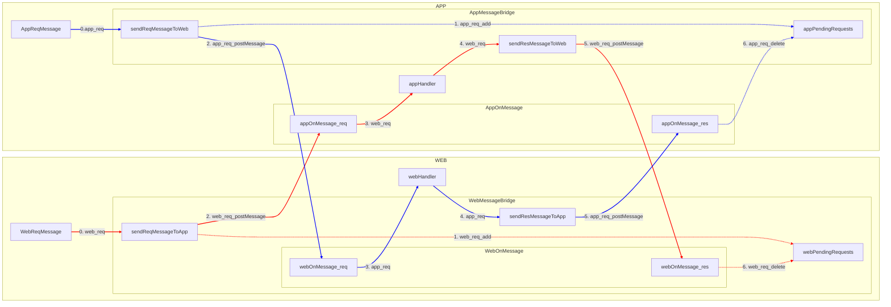

# message_web_app 다이어그램

```mermaid
%% WEB <-> APP 메시지 통신
graph LR
%% __START
    WebReqMessage --> |0. web_req| sendReqMessageToApp
    sendReqMessageToApp -.-> |1. web_req_add| webPendingRequests
    sendReqMessageToApp --> |2. web_req_postMessage| appOnMessage_req
    appOnMessage_req --> |3. web_req| appHandler
    appHandler --> |4. web_req| sendResMessageToWeb
    sendResMessageToWeb --> |5. web_req_postMessage| webOnMessage_res
    webOnMessage_res -.-> |6. web_req_delete| webPendingRequests

    linkStyle 0,1,2,3,4,5,6 stroke:red, stroke-width:2px;

    AppReqMessage --> |0.app_req| sendReqMessageToWeb
    sendReqMessageToWeb -.-> |1. app_req_add| appPendingRequests
    sendReqMessageToWeb --> |2. app_req_postMessage| webOnMessage_req
    webOnMessage_req --> |3. app_req| webHandler
    webHandler --> |4. app_req| sendResMessageToApp
    sendResMessageToApp --> |5. app_req_postMessage| appOnMessage_res
    appOnMessage_res -.-> |6. app_req_delete| appPendingRequests
    linkStyle 7,8,9,10,11,12,13 stroke:blue, stroke-width:2px;


    subgraph WebOnMessage
        webOnMessage_res
        webOnMessage_req
    end

    subgraph AppOnMessage
        appOnMessage_req
        appOnMessage_res
    end

    subgraph WebMessageBridge
        webPendingRequests
        sendReqMessageToApp
        sendResMessageToApp
        WebOnMessage
    end

    subgraph WEB
        WebMessageBridge
        webHandler
        WebReqMessage
        WebOnMessage
    end

    subgraph AppMessageBridge
        appPendingRequests
        sendReqMessageToWeb
        sendResMessageToWeb
    end

    subgraph APP
        AppMessageBridge
        appHandler
        AppReqMessage
        AppOnMessage
    end
%% __END


```
