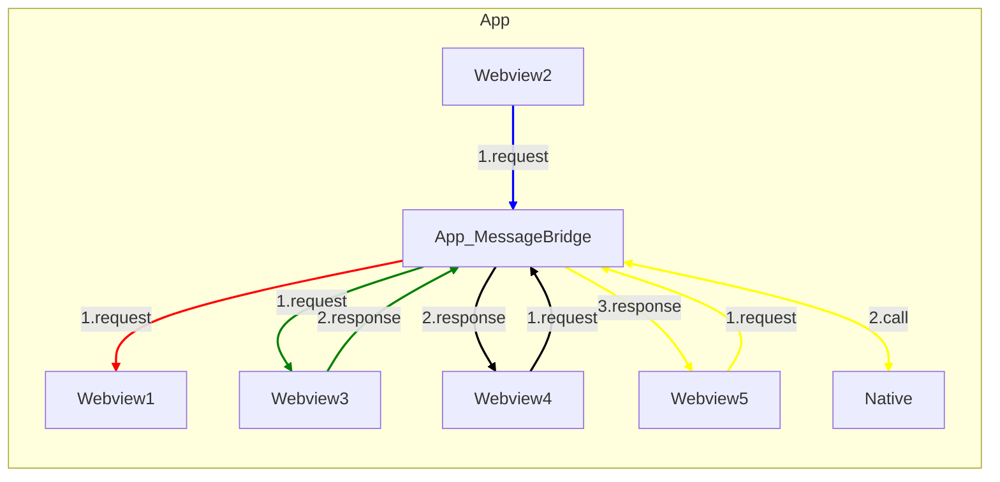

# message_web_app_list 다이어그램

```mermaid
%% react-native-webview 메시지 통신 방식 종류
graph LR
%% __START
    App_MessageBridge --> |1.request| Webview1

    Webview2 --> |1.request| App_MessageBridge

    App_MessageBridge --> |1.request| Webview3
    Webview3 --> |2.response| App_MessageBridge

    Webview4 --> |1.request| App_MessageBridge
    App_MessageBridge --> |2.response| Webview4

    Webview5 --> |1.request| App_MessageBridge
    App_MessageBridge <--> |2.call| Native
    App_MessageBridge --> |3.response| Webview5


    subgraph App
        Webview1
        Webview2
        Webview3
        Webview4
        Webview5
        App_MessageBridge
        Native
    end

    linkStyle 0 stroke:red, stroke-width:2px;
    linkStyle 1 stroke:blue, stroke-width:2px;
    linkStyle 2,3 stroke:green, stroke-width:2px;
    linkStyle 4,5 stroke:black, stroke-width:2px;
    linkStyle 6,7,8 stroke:yellow, stroke-width:2px;
%% __END
```
