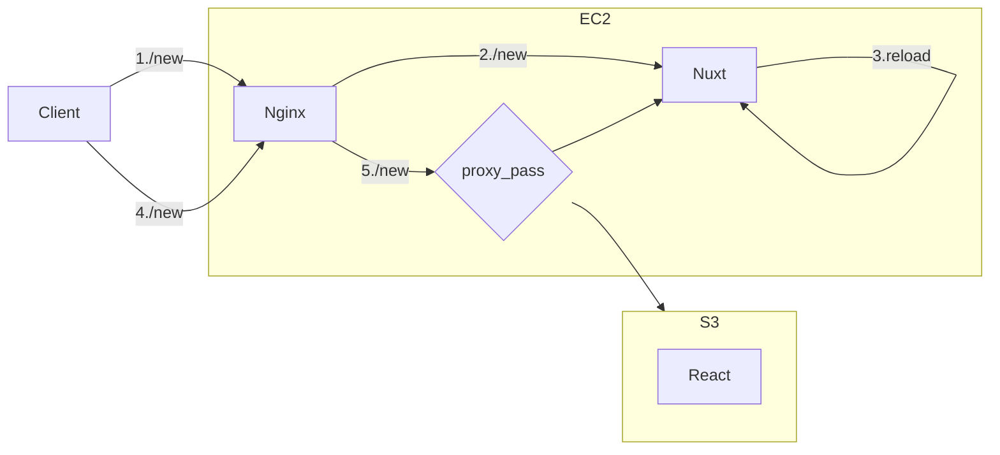

# migration_ec2_s3 다이어그램

```mermaid
%% Migration ec2 -> s3
graph LR
%% __START
    subgraph S3
        React
    end

    subgraph EC2
        Nginx
        Nuxt
        Condition
    end

    Client --> |1./new| Nginx
    Nginx --> |2./new| Nuxt
    Nuxt --> |3.reload| Nuxt
    Client --> |4./new| Nginx
    Nginx --> |5./new| Condition
    Condition{proxy_pass}
    Condition --> Nuxt
    Condition --> S3
%% __END


```
