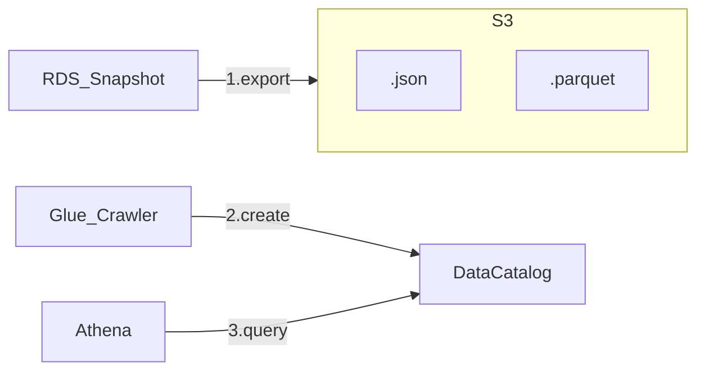

# rds-snapshot 다이어그램

```mermaid
%% RDS snapshot
graph LR
%% __START
    RDS_Snapshot --> |1.export| S3
    Glue_Crawler --> |2.create| DataCatalog
    Athena --> |3.query| DataCatalog

    subgraph S3
        .json
        .parquet
    end
%% __END
```
