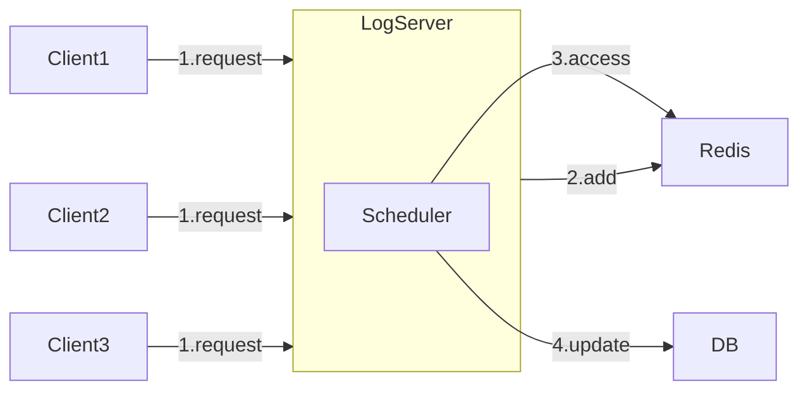

# redis_kpi 다이어그램

```mermaid
%% Use Redis, KPI
graph LR
    %% __START
    Client1 --> |1.request| LogServer
    Client2 --> |1.request| LogServer
    Client3 --> |1.request| LogServer
    LogServer --> |2.add| Redis
    Scheduler --> |3.access| Redis
    Scheduler --> |4.update| DB

    subgraph LogServer
        Scheduler
    end
    %% __END


```
