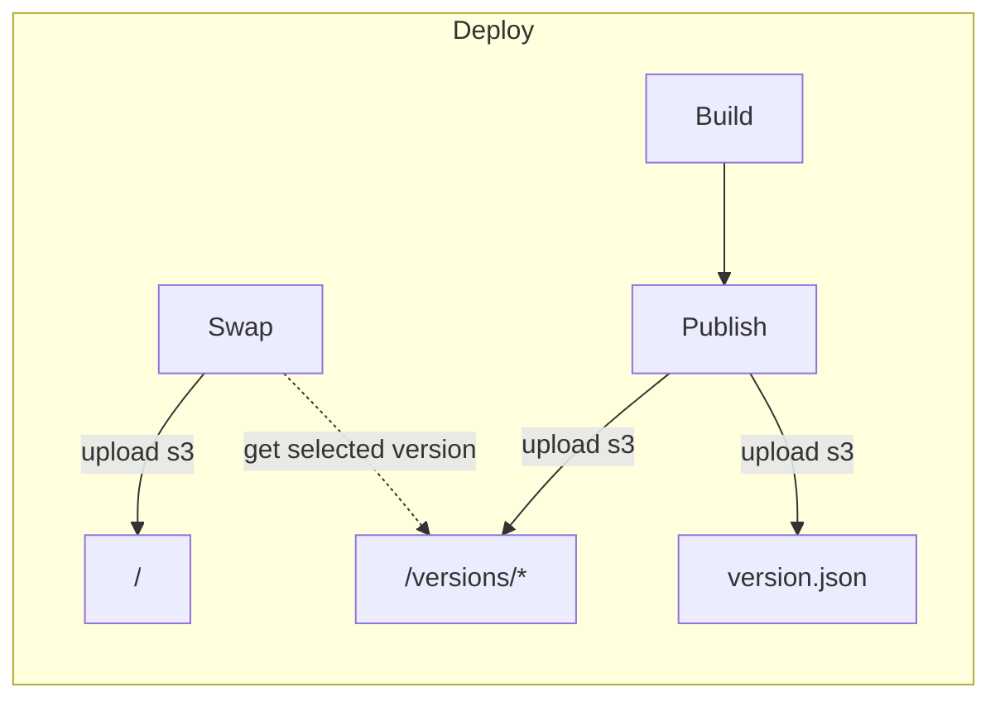

# s3_deploy 다이어그램

```mermaid
%% S3 버전 배포
graph LR
    %% __START
    Build --> Publish
    Swap --> |upload s3| /
    Swap -.-> |get selected version| /versions/*
    Publish --> |upload s3| /versions/*
    Publish --> |upload s3| version.json

    subgraph "Deploy"
        Build
        Publish
        Swap
        /
        /versions/*
        version.json
    end
    %% __END


```
