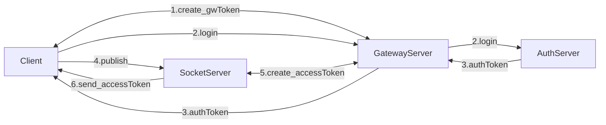

# socket_login 다이어그램

```mermaid
%% 로그인 과정에서 소켓의 역할
%% 크리티컬한 기능을 담당하고 있기에, 소켓 통신은 HTTP 통신처럼 요청-응답 모델 구조를 지원해야합니다.
graph LR
    %% __START
    Client <--> |1.create_gwToken| GatewayServer
    Client --> |2.login| GatewayServer
    GatewayServer --> |2.login| AuthServer
    AuthServer --> |3.authToken| GatewayServer
    GatewayServer --> |3.authToken| Client
    Client --> |4.publish| SocketServer
    SocketServer <--> |5.create_accessToken| GatewayServer
    SocketServer --> |6.send_accessToken| Client
    %% __END


```
