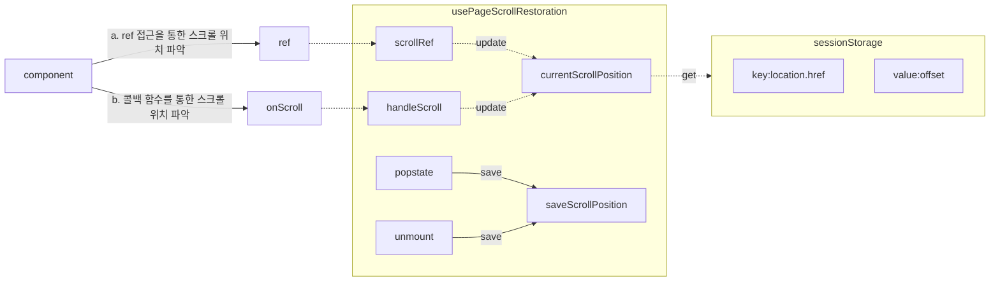

# usePageScrollRestoration 다이어그램

```mermaid
%% URL 기반 스크롤 위치 저장
graph LR
%% __START
    component --> |a. ref 접근을 통한 스크롤 위치 파악| ref
    ref -.-> scrollRef

    component --> |b. 콜백 함수를 통한 스크롤 위치 파악| onScroll
    onScroll -.-> handleScroll


    scrollRef -.-> |update| currentScrollPosition

    handleScroll -.-> |update| currentScrollPosition

    currentScrollPosition -.-> |get| sessionStorage

    popstate --> |save| saveScrollPosition
    unmount --> |save| saveScrollPosition

    subgraph usePageScrollRestoration
        scrollRef
        handleScroll
        currentScrollPosition
        popstate
        unmount
        saveScrollPosition
    end

    subgraph sessionStorage
        key:location.href
        value:offset
    end
%% __END


```
